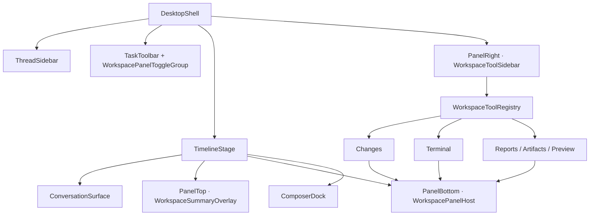

# C-AICLI × Codex App 客户端 UI 对比与组件化规划 V1.4

> 状态：全部产品需求已冻结；等待用户明确授权后才能进入实现
> 日期：2026-08-06
> 范围：Desktop Renderer 的布局、信息架构、交互、组件与视觉回归；本轮不修改产品 UI

## 0. 已冻结的产品要求

| 决策 | 已确认结论 |
|---|---|
| Codex 基线 | 当前 Windows ChatGPT Desktop 的 Codex 模式 |
| 三面板 | 不替换已验收的 PanelTop / PanelBottom / PanelRight，在原合同内修改 |
| 品牌 | 保留 C-AICLI 品牌、森林绿与中文优先；对齐 Codex 的布局与交互 |
| Terminal | 直接以完整 PTY 为目标 |
| Changes | 包含真实 stage、revert、commit、push 写操作 |
| 三面板默认态 | wide 默认打开 PanelTop / PanelRight，PanelBottom 恢复 workspace 上次状态；compact / narrow Drawer 互斥 |
| PanelBottom | Changes 与 Terminal 复用同一详情宿主并互斥切换 |
| PTY 会话 | 每个任务支持多 Tab，首版单 Pane；shell profile 由 AppHost 枚举 |
| PTY 生命周期 | 隐藏与切任务保持，切 workspace 提示，退出 App 终止；Agent 不得注入用户 PTY |
| Git 粒度 | file + hunk；不做 line；不允许 revert 删除 untracked；stale diff fail closed |
| Commit / Push | 普通 commit、hooks on、允许 set upstream、使用系统凭据、分开确认、永久禁止 force |
| 本轮扩展范围 | Worktree、Branch / Compare / PR、Sub-agents、本地 Settings、Slash、附件、消息动作 |
| 明确后置 | Cloud、云账号、插件市场、Scheduled、多项目总览 |

这些确认允许继续做组件、协议、状态机与测试规划，不代表已经授权修改 Renderer、AppHost 或后端。

## 1. 目标与边界

本轮目标不是逐像素复制 Codex 品牌，而是先回答三个问题：

1. 当前 Codex App 的每个主要界面区块承担什么任务？
2. C-AICLI 当前对应区块已具备什么、缺什么、哪里出现信息层级冲突？
3. 哪些内容可以只重组客户端，哪些必须增加 AppHost / `desktop-v1` 能力？

只有本文件第 8 节的剩余产品决策全部确认后，才进入组件化开发。

## 2. 对比基线

### 2.1 Codex App 参考基线

以 2026-08-06 可见的 OpenAI 官方产品资料为参考：

- 项目与任务组织、并行 Agent / worktree、线程内 Changes Review；
- 新任务的 Local / Worktree / Cloud 环境选择；
- Changes 中的 diff、逐行评论、stage / revert / commit / push；
- 每个任务关联的集成终端；
- Skills、Plugins、Scheduled 等全局入口。

参考链接：

- https://openai.com/index/introducing-the-codex-app/
- https://learn.chatgpt.com/docs/app
- https://learn.chatgpt.com/docs/code-review
- https://learn.chatgpt.com/docs/integrated-terminal
- https://learn.chatgpt.com/docs/environments/modes
- https://learn.chatgpt.com/docs/environments/git-worktrees
- https://learn.chatgpt.com/docs/build-skills
- https://learn.chatgpt.com/docs/build-plugins

说明：Codex App 会持续更新，也可能因账号、平台和功能开关不同而变化。正式冻结像素与快捷键基线前，需要由产品方确认目标版本并提供三张目标客户端截图：默认任务、Changes 打开、Terminal 打开。

### 2.2 C-AICLI 当前基线

当前实现是 Electron + React 的 Chat-first Shell，核心区块为：

- 左侧当前工作区会话栏；
- 中央连续对话 Timeline；
- 底部 Composer；
- 顶部 Workspace Summary；
- 底部 Workspace Detail；
- 右侧 Workspace Tools；
- Changes、Terminal、Reports、Artifacts、Preview 等工具面板。

现有截图与自动 Gate 主要来自旧 revision，早于最新 Composer 调整，因此只能作为结构证据，不能作为当前像素基线。

## 3. 逐区块对比矩阵

状态含义：

- **已对齐**：核心任务与交互模型相近，可保留；
- **部分对齐**：已有能力，但入口、反馈或层级不同；
- **缺失**：客户端无对应产品面；
- **需协议**：不能靠 Renderer 组件补齐，需要后端合同；
- **需确认**：不同产品定位存在合理分叉，不能擅自照搬。

| # | Codex 区块 | Codex 任务 | C-AICLI 当前对应 | 状态 | V1.1 结论 |
|---|---|---|---|---|---|
| 01 | 应用级侧栏头部 | 产品切换、品牌/账号上下文 | C-AICLI 品牌与工作区路径 | 已确认 | 保留 C-AICLI 品牌、森林绿与中文优先 |
| 02 | 主导航 | New chat、Search、Scheduled、Plugins 等 | New conversation、会话搜索/筛选；Skills/Experts/Automations 位于 Composer | 部分对齐 | 把全局入口从任务 Composer 分离，形成稳定主导航 |
| 03 | 项目与任务列表 | Projects 下组织任务，支持置顶/历史任务 | 仅当前工作区会话，按日期和状态分组 | 部分对齐 / 需协议 | 第一阶段保留单工作区；多项目、置顶、跨工作区另立协议 |
| 04 | 任务标题栏 | 项目/分支/任务上下文；Changes、Terminal 等聚焦动作 | Open workspace + 三个抽象面板按钮 | 偏离 | 改为语义化任务标题栏；不再让用户理解 PanelTop/Bottom/Right |
| 05 | 对话主区 | 内容优先；消息、工具过程、审批、恢复 | 连续 Timeline、工具活动、审批、Stop、恢复 | 已对齐 | 保留现有权威状态机；补消息动作、代码块操作和滚动恢复 |
| 06 | PanelTop / Workspace Summary | 提供当前任务上下文而不抢占主视觉 | 顶部绝对定位摘要层 | 保留并重构 | 保留 PanelTop 合同，收敛为可折叠的紧凑任务上下文 |
| 07 | Composer | 上下文附件、命令、技能、模型/权限；环境与分支选择 | 文件/文件夹、@、Skills/Experts/Automations、只读模型/审批、发送/停止 | 部分对齐 | 拆成输入、上下文、能力、运行设置四组组件；环境/分支需协议 |
| 08 | Changes / Review | 作用域、文件树、真实 diff、逐行评论、stage/revert/commit/push | Git 摘要、统计和文件列表；提交/推送禁用 | 已纳入 / 需协议 | 右侧选择 Changes，PanelBottom 承载真实 Review 与 Git 写操作 |
| 09 | Terminal | 每个任务/工作树关联的完整终端 | 可 open/input/cancel/close 的命令输出面板 | 已纳入 / 需协议 | 右侧选择 Terminal，PanelBottom 承载完整 PTY、会话 Tab、ANSI 与 resize |
| 10 | PanelRight / 工具导航 | 快速选择当前工作区工具 | 永久 Workspace Tools 目录，含多项占位入口 | 保留并重构 | 保留 PanelRight 作为工具注册与状态导航；点击只选工具，不直接执行写操作 |
| 11 | Reports / Artifacts / Preview | 不要求与 Codex 一一对应 | C-AICLI 的领域输出优势 | 产品特有 | 保留能力，改成对话结果附件或聚焦 Result Drawer |
| 12 | Agent / Worktree 状态 | 多 Agent 并行、独立 worktree、handoff | Sub-agents Unknown；Branch/Compare 不可用 | 缺失 / 需协议 | 先定义任务环境和后台状态合同，再设计产品面 |
| 13 | Settings / Account | 外观、账号、通知、模型/权限等设置入口 | 无 Settings / Preferences / Account 页面 | 缺失 / 需确认 | 先确认设置范围；不要只做空壳入口 |
| 14 | Theme / Language | 系统主题与一致的本地化体验 | Light-only；中英混用；`lang=en` | 缺失 | 建立 light/dark/system token 与中文优先文案合同 |
| 15 | 响应式窗口 | 对话始终是第一视觉层；面板按需出现 | 三档几何安全，但 1024/800 下多层同时压缩对话 | 需确认 | 保留三个逻辑面板；compact / narrow 的互斥、折叠和状态记忆仍需冻结 |

## 4. 核心判断

### 4.1 应保留的已有资产

- Timeline / Conversation、审批、Stop、恢复的状态模型；
- Thread Sidebar 的搜索、筛选、日期分组、重命名、归档；
- Composer 的上下文选择、mention 与 send/stop 机制；
- Changes、Terminal、Reports、Artifacts、Preview 已有数据适配器；
- wide / compact / narrow 的响应式判定与面板宽度约束；
- 现有 Bridge、controller、reducer 作为权限与状态权威层。

### 4.2 在三面板合同内部重新编排

- `WorkspaceSummaryOverlay` 保留为 PanelTop，但内容压缩为运行状态、工作区、分支、模型和审批模式；
- `WorkspaceBottomPanel` 保留为统一 `WorkspacePanelHost`，承载当前选中的 Changes、Terminal、Reports、Artifacts 或 Preview；
- `WorkspaceToolSidebar` 保留为 PanelRight，只负责工具导航、能力状态和 badge；
- 顶部 PanelTop / PanelBottom / PanelRight 三个开关及响应式合同继续保留；
- PanelRight 的导航点击只能选择工具并打开 PanelBottom，不得直接执行 stage、revert、commit、push 或启动 PTY；
- Reports / Artifacts / Preview 作为 C-AICLI 差异化能力保留，并在 PanelBottom 内统一呈现。

### 4.3 不能伪装成已完成的功能

以下能力必须先扩展协议，不能只制作可点击占位 UI：

- 多项目、Local / Worktree / Cloud 环境及 handoff；
- Branch / Compare branches；
- 真实 diff hunk、逐行评论；
- Stage / Revert / Commit / Push（已确认纳入）；
- PR 创建与状态；
- 后台 Sub-agents；
- Plugins / Scheduled 的真实列表与执行；
- 可编辑模型、审批模式及持久化设置。

## 5. 推荐信息架构

布局规则：

- PanelTop、PanelBottom、PanelRight 的逻辑身份与开关保持不变；
- PanelTop 是紧凑任务上下文，PanelRight 是工具选择，PanelBottom 是当前工具详情；
- Changes 与 Terminal 复用 PanelBottom，不在 Renderer 创建第四个常驻工作区；
- 宽屏允许三个面板同时出现，但对话区必须保留可用最小宽高；
- compact / narrow 继续使用抽屉与互斥规则，精确行为在第 8 节确认；
- Composer 始终可达；PanelBottom 的展开、切换与 resize 不得终止 PTY 会话。

## 6. 组件规划

### 6.1 Foundation

- `DesktopThemeProvider`
- `DesignTokens`
- `IconButton` / `TextButton` / `MenuButton`
- `Tooltip` / `Popover` / `Dialog`
- `ResizablePanel` / `ResponsiveDrawer`
- `EmptyState` / `StatusBadge` / `Skeleton`

### 6.2 Shell

- `DesktopShell`
- `AppSidebar`
- `TaskHeader`
- `TaskWorkspace`
- `WorkspacePanelToggleGroup`
- `WorkspaceSummaryOverlay`
- `WorkspaceToolSidebar`
- `WorkspacePanelHost`
- `WorkspaceToolRegistry`
- `useWorkspacePanels`
- `OverlayHost`

### 6.3 Sidebar

- `SidebarHeader`
- `PrimaryNav`
- `ProjectSection`
- `TaskList`
- `TaskListItem`
- `SidebarFooter`

### 6.4 Conversation 与 Composer

- `ConversationViewport`
- `UserMessage`
- `AssistantMessage`
- `ToolActivityGroup`
- `ApprovalCard`
- `ResultAttachment`
- `ComposerDock`
- `ComposerInput`
- `ContextPicker`
- `CapabilityPicker`
- `RuntimeSelector`
- `SendControl`

### 6.5 Changes / Git

- `ChangesWorkspacePanel`
- `ReviewScopeTabs`
- `ChangesFileList`
- `DiffViewer`
- `DiffHunk`
- `DiffActionBar`
- `InlineReviewComment`
- `GitActionBar`
- `CommitDialog`
- `PushDialog`
- `useChangesController`

### 6.6 Full PTY

- `TerminalWorkspacePanel`
- `TerminalToolbar`
- `TerminalSessionTabs`
- `PtyTerminalViewport`
- `XtermAdapter`
- `TerminalResizeObserver`
- `useTerminalSessions`

### 6.7 Results

- `ResultDrawer`
- `ArtifactViewer`

### 6.8 兼容与协议策略

新组件只负责呈现与交互编排；既有 controller、reducer 和 Bridge 继续负责状态与权限。没有协议的能力必须呈现为“未纳入本阶段”，而不是 Disabled 假按钮。

- PTY 会话生命周期独立于 PanelBottom 显隐；收起或切换工具不能自动终止进程；
- Renderer 只负责终端渲染，不得直接启动 shell；AppHost / typed IPC 保持进程权威；
- PTY 协议至少需要流式 output sequence、cols/rows resize、Ctrl+C 与 terminate 分离、退出码、重连和有界 scrollback；
- Changes mutation 必须携带 `workspaceId`、repo identity、expected revision/diff identity 与 `clientMutationId`；
- Revert 必须强确认，默认不删除 untracked；Commit 不隐式 stage；Push 必须显示 remote/branch/upstream，默认禁止 force。

## 7. 实施阶段与验收门

### P0 — 比较与产品决策（当前）

- 冻结 Codex 目标版本、主题、窗口尺寸与参考截图；
- 完成本文件与交互效果稿审阅；
- 逐项确认第 8 节决策。

验收门：产品确认，不产生客户端代码变更。

### P1 — 纯客户端信息架构收敛

- 保持三开关与三面板外部合同；
- 拆分 `WorkspaceToolRegistry`、`WorkspacePanelHost` 与面板内部组件；
- 将 PanelTop 收敛为紧凑上下文，将 PanelRight 收敛为工具导航；
- 整理 tokens、light/dark/system 与中英文案；
- 保持现有协议与业务行为不变。

验收门：默认、Changes、Terminal、审批、错误五类状态，在 1440×900、1024×768、800×900、760×560 下通过人工和自动视觉对比。

### P2 — Full PTY 垂直切片

- 新增 PTY 流式协议、会话 ownership 与生命周期；
- 接通 resize、ANSI/VT、光标、交互程序、Ctrl+C、复制粘贴和有界 scrollback；
- 在 PanelBottom 内实现 session tabs 与 shell profile；
- 完成切任务、切 workspace、Renderer reload 与 App 退出行为。

验收门：真实 ConPTY / shell 会话 E2E，面板切换不丢会话且不产生孤儿进程。

### P3 — Changes 与 Git 写操作垂直切片

- 新增 staged / unstaged / untracked / conflicted 投影与真实 diff；
- 按确认粒度实现 stage / unstage；
- 实现有预览、revision 校验和审计记录的 revert / commit / push；
- 处理 hooks、认证失败、无 upstream、远端领先与 non-fast-forward。

验收门：只在独占临时仓库与本地 bare remote 中做写操作 E2E，绝不触碰当前工作区。

### P4 — 其余 Codex parity 能力

- 多项目 / worktree / environment；
- Branch / Compare / PR；
- Plugins / Scheduled / Sub-agents / Settings；
- 消息动作、Composer 命令与附件。

验收门：每项先确认范围，再建立 AppHost / `desktop-v1` 合同、权限与失败状态。

### P5 — 回归与发布

- 建立当前 revision 的 golden screenshot；
- Codex 参考图、C-AICLI 结果图和差异图绑定同一状态/尺寸；
- 测试真实 Electron 窗口 resize、DPI、键盘、焦点、长内容；
- 检查打包版与真实 AppHost，而不只依赖 fixture Renderer。

## 8. 开发前必须确认的决策

### D1 — Codex 对齐基线

- **已确认**：当前 Windows ChatGPT Desktop 的 Codex 模式。
- 仍需记录可重复 Gate 的具体 build、主题、Windows 显示缩放和应用 zoom。

### D2 — “功能一样”的范围

- **已确认纳入**：Full PTY、Changes 写闭环、Worktree、Branch / Compare / PR、Sub-agents、本地 Settings、Slash、附件与消息动作。
- **已确认后置**：Cloud、云账号、插件市场、Scheduled、多项目总览。

### D3 — 品牌与视觉

- **已确认**：保留 C-AICLI 名称、森林绿与中文优先，对齐 Codex 的布局与交互。

### D4 — 已验收三面板的处置

- **已确认**：保留 PanelTop / PanelBottom / PanelRight，在原合同内修改。

### D5 — Terminal 定义

- **已确认**：直接追求完整 PTY。

### D6 — Changes 定义

- **已确认**：真实 diff review，并包含 stage、revert、commit、push。

### D7 — 三面板默认态与窄屏规则

- **已确认**：wide 默认打开 PanelTop 与 PanelRight，PanelBottom 恢复该 workspace 上次状态。
- **已确认**：compact / narrow 保留三个逻辑面板，但 Drawer 互斥。
- **已确认**：面板开关与尺寸按 workspace 记忆。

### D8 — PTY 会话、Shell 与权限

- **已确认**：每个任务支持多 Tab，首版单 Pane，split pane 后置。
- **已确认**：PowerShell 为默认；cmd、WSL、Git Bash 只在 AppHost 检测到受控 profile 后提供。
- **已确认**：隐藏面板、切换工具和任务时保持；切 workspace 时提示；退出 App 时终止。
- **已确认**：用户直接输入视为明确授权；越出 workspace 需要确认。
- **已确认**：Agent 永远不能向用户 PTY 自动注入命令，Agent shell 继续走独立审批通道。

### D9 — Stage / Revert 粒度与并发

- **已确认**：stage / unstage / revert 支持文件级和 hunk 级，首版不做 line 级。
- **已确认**：不允许 revert 删除 untracked 文件。
- **已确认**：执行前重新校验 repo、HEAD、index、file 与 diff identity；任何漂移都 fail closed。

### D10 — Commit / Push 安全语义

- **已确认**：只做普通 commit，正常运行 hooks，不支持 amend 或跳过 hooks。
- **已确认**：允许首次 set upstream；Git push 使用系统 Git Credential Manager。
- **已确认**：commit 与 push 分开确认，不提供默认“Commit and push”。
- **已确认**：永久禁止 force push。

### D11 — 其他 Codex 产品面

- **已确认纳入**：Worktree、Branch / Compare / PR、Sub-agents、本地 Settings。
- **已确认后置**：Cloud、云账号、插件市场、Scheduled、多项目总览。
- parity 定义为本地工程闭环、布局和操作节奏对齐，不复制云账号、团队或品牌表面。

### D12 — 对话与 Composer

- **已确认纳入**：Slash commands、附件与消息动作。
- **保留**：Skills、Experts、Automation，但降低视觉权重。
- 首批命令、附件边界、历史不可变语义和 Model / Approval 可编辑范围仍需在 D17–D19 冻结。

### D13 — 精确视觉基线

- **已确认**：只建立一个 1024×768 视觉基线与极限验收尺寸。
- 不再为 1440×900、800×900、760×560、200% zoom 或深色主题建立额外像素基线。
- 对齐当前 Windows ChatGPT Desktop Codex 模式的信息架构、几何、密度、操作位置、状态变化和键盘路径；不复制 Logo 与品牌资产。

### D14 — Terminal 输出隐私

- **已确认**：Agent 默认完全看不到用户 PTY，仅能通过“分享所选输出”显式加入当前 Turn。
- **已确认**：禁止一键分享完整会话；分享前预览、脱敏、截断并生成受管 Context。
- **已确认**：禁用 OSC 52，链接与外部文件必须点击后确认。
- **已确认**：transcript 只在内存中有界保存，durable audit 仅记录 session/shell/cwd/start/end/exit 元数据。

### D15 — Worktree 所有权与清理

- **已确认**：第一个任务默认当前 workspace；并行任务或 dirty workspace 时推荐 managed Worktree。
- **已确认**：只管理 AppHost 创建并登记 owner/thread/branch 的 Worktree。
- **已确认**：Worktree 位于仓库外的受管目录，分支前缀使用 caicli/。
- **已确认**：归档永不自动删除；clean 且已合并时也先确认，只移除 Worktree，branch 单独确认。

### D16 — PR Provider 与操作范围

- **已确认**：Provider-neutral UI，首发仅 GitHub；GitLab、Azure DevOps 与 Enterprise 后置。
- **已确认**：复用已安装且已登录的 gh，C-AICLI 不保存 PAT。
- **已确认**：默认 Draft；首期支持读取、创建、更新标题正文和打开浏览器。
- **已确认**：Merge、Close、Delete 与提交 Review 后置；Push 与 Create PR 是两个独立动作。

### D17 — Local Settings

- **已确认**：Settings 替换中央任务区，返回任务后恢复三面板，不使用模态窗口。
- **已确认**：用户级管理语言、主题、快捷键、面板默认值、默认 shell/model/approval。
- **已确认**：workspace override 管理 model、approval、disabled tools、shell cwd/profile、Git/PR base。
- **已确认**：Model / Approval 支持两级编辑，只影响下一 Turn。
- **已确认**：Approval 使用只读、按需审批、受信任本地三档；受信任本地仍确认 workspace 外写入、危险 Git 与网络动作。
- **已确认**：凭据只进入 Windows Credential Manager，Renderer 与 JSON 永不获取明文。

### D18 — 附件与消息历史

- **已确认**：工作区内 file/folder/image 可直接选择；外部仅允许显式选择的普通单文件和图片。
- **已确认**：外部内容复制为 task-scoped、只读、content-hash 快照；首版拒绝外部目录、UNC、设备文件、可执行文件和压缩包。
- **已确认**：选中附件不等于发送，只有随某条消息发送才进入 Agent context。
- **已确认**：durable history 不可变；Edit / Branch 创建带 source pointer 的新 Thread，Retry 必须防止重放已完成写操作。

### D19 — Sub-agent 合同

- **已确认**：每个主任务最多 3 个 Sub-agent，可在 1–3 之间调低；加主任务最多 4 个执行主体。
- **已确认**：首版 Sub-agent 不能继续派生 Sub-agent。
- **已确认**：写入型 Sub-agent 独占 managed Worktree，只读 Agent 可以共享源 workspace。
- **已确认**：每个写操作独立经过 parent task 的权威审批，不能继承其他 Agent 或主任务的一次性授权。
- **已确认**：只能由用户明确创建和取消；打开 PanelRight 导航不会自动启动。
- **已确认**：取消时终止进程，但保留 Worktree、Changes、结果摘要和审计证据。
- **已确认**：“接管 Worktree”先停止 Agent，再把该 Worktree 交给主任务；不会自动合并或清理。

## 9. 对比测试矩阵

### 9.1 核心用户路径

1. 新建任务 → 第一条消息 → 第二轮连续对话；
2. 创建第二个任务 → 双向切换 → 草稿/滚动隔离；
3. 工具调用折叠/展开 → 失败详情 → 复制结果；
4. 审批批准/拒绝/过期/失败 → 焦点回归；
5. 打开 Changes → staged/unstaged/untracked/conflict → 文件或 hunk 选择 → stage/unstage/revert；
6. Commit → hooks 成功/失败 → Push → 无 upstream/认证失败/non-fast-forward；
7. 打开 Terminal → PTY opening/running/exited/error/restart → ANSI/Unicode/Ctrl+C/交互程序；
8. PTY resize、切面板、切任务、reload、App 退出的会话生命周期；
9. 重命名、归档、搜索、筛选及持久化；
10. 打开结果附件、Reports、Artifacts、Preview；
11. 窗口缩放时面板互斥、Composer 可达、无横向滚动。

### 9.2 视觉状态

- Empty / selected / running / completed / failed / canceled；
- approval / stale approval / recovery / runtime unavailable；
- Changes empty / loading / populated / long path / large diff；
- Terminal closed / running / output / truncated / exited / error；
- Composer empty / multiline / context chips / picker / IME；
- light / dark / system；
- 中文、英文、长标题、长路径、长风险摘要。

### 9.3 窗口与平台

- 1440×900、1024×768、800×900、760×560；
- 125%、150%、200% 缩放；
- 实际 BrowserWindow resize / maximize / minimize；
- packaged Windows App + 真实 AppHost；
- 键盘全流程与可访问性规则扫描。

## 10. 当前结论

当前方向已经从“替换三面板”修订为“保持三面板外部合同、重构内部语义与能力”。PanelTop 负责紧凑上下文，PanelRight 负责工具选择，PanelBottom 负责当前工具详情；完整 PTY 与 Changes 写闭环都在这一结构内落地。

D1–D19 已全部确认，需求范围正式冻结。本规划仍不授权进入客户端或 AppHost 实现；必须等待用户明确发出开始开发指令。
