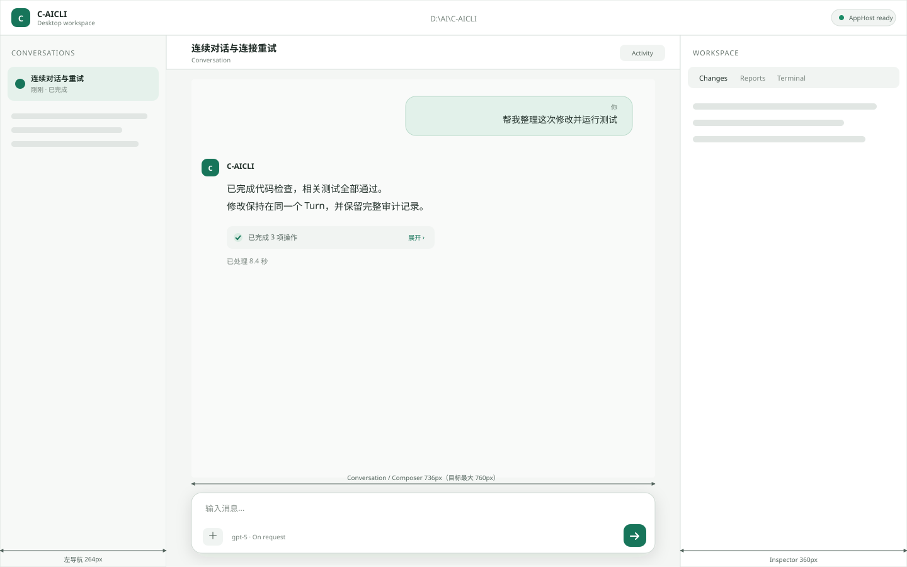
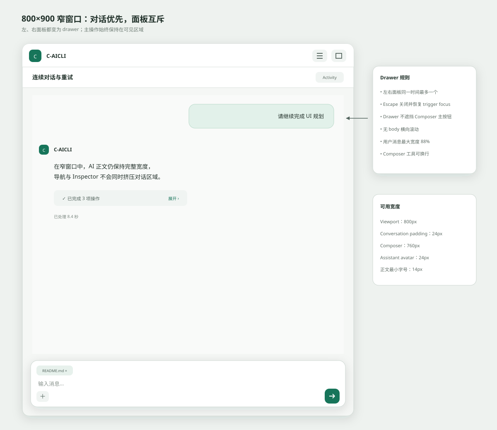
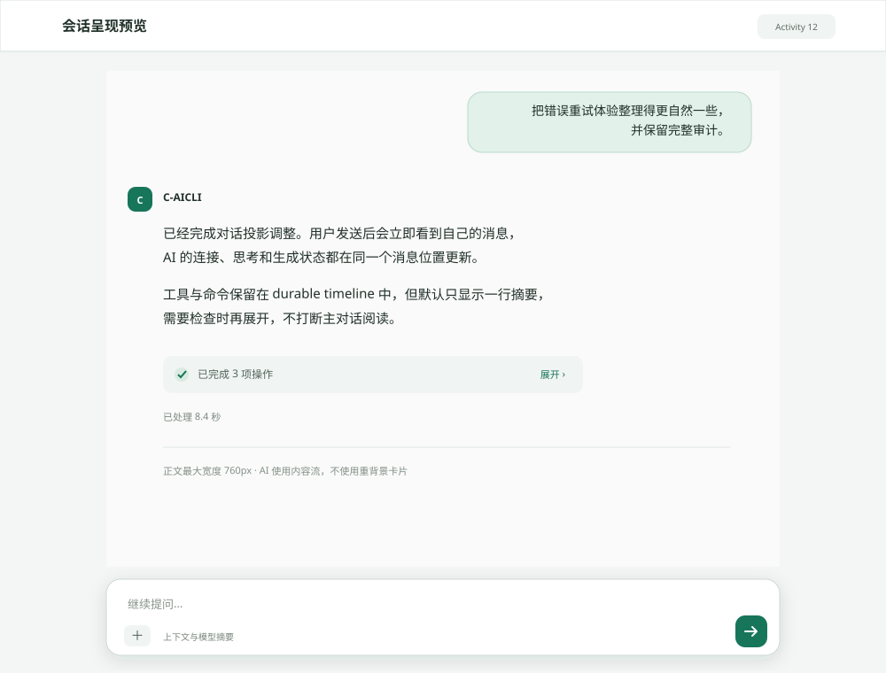
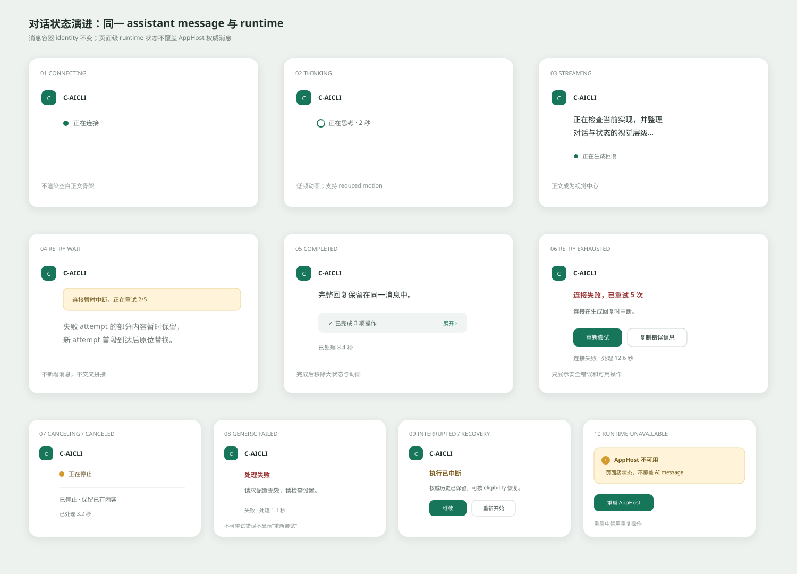
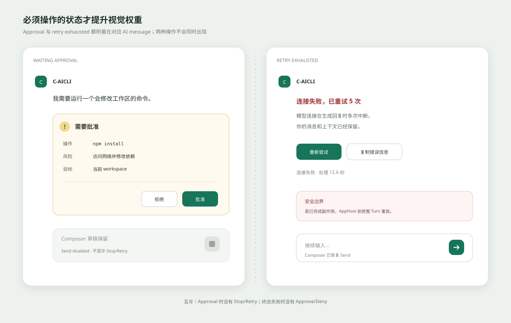

# C-AICLI Chat-first 对话呈现规格

状态：`Draft for visual review`

创建日期：`2026-07-31`

关联需求：

- `docs_md/spec/codex_style_continuous_chat_retry.md`
- `docs_md/spec/codex_style_chat_ui_state_matrix.md`
- `docs_md/weekly/86_week_chat_first_shell_design_system.plan.md`
- `docs_md/weekly/87_week_conversation_projection_timeline.plan.md`
- `docs_md/weekly/88_week_composer_inline_approval_task_controls.plan.md`

本规格只定义 Renderer 的信息层级、布局、视觉状态和交互呈现，不改变 Turn、revision、durable timeline、AppHost authority、审批安全边界或 provider retry 语义。

## 1. 设计目标

主界面第一眼只呈现连续对话，第二眼能判断 C-AICLI 当前状态，需要时才展开工具、命令和审计细节。

必须实现：

1. 用户消息和 AI 回复构成唯一主视觉流。
2. AI 的连接、思考、生成、重试和终态都在同一个 assistant message 内变化。
3. 工具、命令和验证默认压缩为一行活动摘要。
4. 审批、恢复和最终失败只在确实需要用户操作时提升视觉权重。
5. Composer 是稳定的底部输入锚点，发送与 Stop 原位互换。
6. 三个固定验收视口均无重叠、横向页面滚动或不可达控件。

## 2. 非目标

- 不重做左侧 workspace/thread 信息架构。
- 不替换 C-AICLI 品牌或复制 OpenCowork 品牌资产。
- 不改变 desktop-v1 authority、mutation revision 或 retry 防重放规则。
- 不引入富文本编辑器、Monaco、完整 Markdown 插件体系或新的大型 UI 框架。
- 不把原始 timeline 审计事件直接堆回主对话。
- 不在第一阶段承诺完整 dark theme；交付 light theme、forced colors 和 reduced motion。

## 3. 信息层级

从高到低固定为：

| 层级 | 内容 | 默认表现 |
| --- | --- | --- |
| L1 | 用户问题、AI 正文、待处理审批 | 高对比度，持续可见 |
| L2 | 当前阶段、重试、最终耗时 | 紧贴对应 AI 消息，低占高 |
| L3 | 工具、命令、验证、变更摘要 | 单行折叠，可展开 |
| L4 | sequence、revision、attempt 诊断、原始安全 payload | Activity/Audit 中按需查看 |

禁止同时用顶部警告、Turn 卡片、AI 状态行和 Composer 状态重复表达同一运行状态。

## 4. 页面布局

### 4.1 桌面视口：1440 × 900

- Titlebar：高 `56px`。
- 左侧导航：宽 `264px`，允许在 `240–288px` 范围内实现。
- 右侧 Inspector：宽 `360px`，允许用户在 `320–480px` 范围内调整。
- 中央区域：剩余宽度；对话正文最大宽度 `760px`。
- Composer：最大宽度 `760px`，与 AI 正文左、右边界对齐。
- 对话底部安全距离：Composer 上方至少 `16px`，下方至少 `12px`。



### 4.2 中等视口：1024 × 768

- 左侧导航保持 `232–248px`。
- Inspector 改为右侧 overlay drawer，不永久挤压对话区。
- 对话正文使用 `min(720px, 100% - 40px)`。
- Composer 使用 `min(720px, 100% - 32px)`。

### 4.3 窄视口：800 × 900

- 左、右面板都改为 drawer，且同一时间最多打开一个。
- 主区域占满可用宽度。
- 用户消息最大宽度提升到 `88%`。
- AI avatar 可缩小到 `24px`，但正文不得小于 `14px`。
- Composer 工具允许换行，发送/Stop 按钮始终可见。



## 5. 垂直结构

中央区域从上到下固定为：

1. Conversation header：标题、必要的 thread 操作、Activity 入口。
2. Scrollable conversation canvas。
3. Composer dock。

Conversation header 不显示重复运行状态。运行状态属于当前 AI 消息。

## 6. 用户消息

- 右对齐，宽度为内容自适应，最大 `min(72%, 640px)`；窄窗口最大 `88%`。
- 使用轻量 accent surface，边框与背景不得同时过重。
- 圆角建议 `16px 16px 4px 16px`。
- 正文字号 `14–15px`，行高 `1.55–1.65`。
- 默认隐藏“You”和时间；hover、focus 或审计模式可显示时间。
- 乐观消息与权威消息使用同样外观，避免发送时视觉跳变。
- 权威拒绝时原位显示简短错误和“恢复输入”，不得丢失用户文字。

## 7. AI 消息



### 7.1 基础结构

```text
[C]  C-AICLI
     [状态或正文]
     [活动摘要]
     [耗时或恢复操作]
```

- 左对齐，占满 conversation column。
- avatar `28px`；窄窗口可降至 `24px`。
- AI 正文不使用重背景气泡，保持长文本和代码可读性。
- 正文字号 `15px`，行高 `1.65–1.72`。
- assistant identity、DOM key 和 visible block 在同一 Turn 内保持稳定。
- 状态切换不得造成整条消息卸载、滚动跳动或 focus 丢失。

### 7.2 生命周期



#### Connecting

只显示身份和紧凑状态行：`● 正在连接`。不渲染空白正文骨架。

#### Thinking

显示：`◌ 正在思考 · 2 秒`。动态秒数仅为运行时辅助，reload 后不要求恢复中间计时。

#### Streaming

第一段内容到达后正文成为视觉中心；`正在生成回复` 移至正文下方或身份行旁边，使用弱化文字。

#### Retry wait

- 在同一 AI message 内显示柔和 warning strip：`连接暂时中断，正在重试 2/5`。
- 等待期间保留失败 attempt 的部分内容，并降低至约 `65%` opacity。
- 新 attempt 第一段内容到达时原位替换旧内容并恢复正常 opacity。
- 不新增 AI message，不拼接 attempt，不强制滚动到新位置。

#### Completed

- 移除持续动画和“已完成”大状态行。
- 正文下方只保留 `已处理 8.4 秒`。
- 工具摘要保持折叠状态，可按需展开。

#### Canceling

- 用户触发 Stop 后，原位显示 `正在停止`，并立即禁用 Stop，避免重复取消。
- 保留当前 attempt 已显示内容，不创建第二条 AI message。
- 等待 AppHost 返回 authoritative canceled/terminal 状态；Renderer 不提前伪造完成。

#### Canceled

- 保留已经显示的内容。
- 显示 `已停止 · 处理 3.2 秒`。
- 不显示重新尝试，Composer 恢复 Send。

#### Generic failed

- 400、401、403、配置错误、审批拒绝等不可重试失败显示 `处理失败` 和安全摘要。
- 不显示自动重试进度，也不显示“重新尝试”；可在 Activity 中查看安全诊断信息。
- 保留处理时间和已完成的活动，不重放副作用。

#### Retry exhausted

- 在原 AI message 内显示紧凑错误说明。
- 显示 `连接失败 · 处理 12.6 秒`。
- 操作为“重新尝试”和“复制错误信息”。
- 若 AppHost 因已完成副作用拒绝 restart，在原处显示安全错误，不创建新 Turn 占位。

#### Interrupted / recovery-required

- 在原 AI message 内保留权威历史，并显示 `执行已中断` 和安全 reason。
- 只展示 AppHost eligibility 允许的“继续”或“重新开始”，不得由 Renderer 推断恢复能力。
- 恢复操作提交后原位进入 pending 状态，禁止重复提交。

#### Runtime unavailable / restarting

- 这是页面级状态，不属于 AI lifecycle，也不得覆盖已有权威消息。
- AppHost 不可用时，Composer 主操作切换为“重启 AppHost”；重启中禁用重复操作。
- 历史对话保持可读，恢复连接后以 reload/notification 对账结果为准。

## 8. 工具、命令与验证活动

普通完成态默认折叠为：

```text
✓ 已完成 3 项操作                                      展开
```

展开后按原始执行顺序显示：

```text
✓ 读取 src/App.tsx
✓ 更新 TimelineView.tsx
✓ 运行 Renderer 测试
```

规则：

- running、failed 或 waiting approval 的活动必须展示必要摘要。
- 已完成活动默认 collapsed。
- 原始 timeline item 必须能从 Activity/Audit 追溯，不得丢弃 sequence、source、status 或 redaction。
- 工具输出不直接作为大段正文插入主对话。
- code/pre 只能在展开区域内横向滚动，不允许产生 body 横向滚动。

## 9. Approval 与失败操作



ApprovalCard 必须位于对应 Turn/ToolGroup 内，包含：

- 明确标题“需要批准”；
- risk、safe summary 和目标；
- “拒绝”和“批准”两个可见按钮；
- resolved、stale、expired 的只读结果状态。

审批期间：

- Composer 允许保留和编辑草稿，但主按钮禁用；
- 不同时显示 Stop、Restart 或 Retry；
- mutation identity 和 revision 只能来自 authoritative feature state。

最终失败使用 compact recovery block，不扩展为整页错误卡。

## 10. Composer

- 固定在中央底部 slot，不使用 viewport-level `position: fixed`。
- 默认一至三行自适应，最大高度 `180px`，超过后输入区内部滚动。
- 上下文、文件、Skill、Expert 和 Automation 使用一致的可移除 chips。
- 左侧是上下文工具；右侧唯一主按钮为 Send 或 Stop。
- AI 运行时允许继续编辑草稿，但主按钮为 Stop，不能并发提交第二个 Turn。
- Enter 发送，Shift+Enter 换行，IME composing 时 Enter 不发送。
- approval 时输入保留、发送禁用；terminal 后恢复 Send。
- 模型与 approval mode 作为弱化摘要，不与主操作争夺视觉层级。

## 11. Activity 与 Audit

- Conversation/Activity 使用一个低权重入口切换，不渲染永久双栏 timeline。
- Activity 保留完整 durable timeline 的有界投影。
- 切换 Activity 不改变当前 thread、scroll authority、active Turn 或 Composer draft。
- unknown/new timeline type 必须进入 `AuditFallback`，不得静默丢弃。

## 12. 视觉 token

所有实现使用现有 CSS semantic variables，不在组件内散落固定色值。

| Token 类别 | 目标 |
| --- | --- |
| Canvas/surface | 页面、消息、drawer 层级清晰但不过度卡片化 |
| Text | 正文、次级、禁用至少三级 |
| Accent | Send、active、focus 和运行状态 |
| Warning | retry wait，不与最终 failure 共用强红色 |
| Danger | 最终失败、拒绝和不可恢复错误 |
| Spacing | 4/8/12/16/24/32 的离散尺度 |
| Radius | 8/12/16，消息与 Composer 不超过 20 |
| Motion | 120–180ms 状态转换；pulse 1.2–1.8s；支持 reduced motion |

禁止仅靠颜色传达状态；必须同时提供文字、图标形状或可访问名称。

## 13. 滚动规则

- 用户位于底部 `96px` 范围内时跟随当前 assistant 更新。
- 用户阅读历史时不强制滚到底部，显示“回到最新”入口。
- 同一 assistant 内容替换不得产生第二个 scroll target。
- thread 切换后恢复该 thread 的权威最新位置，不接受旧 thread 的迟到响应。
- load more 保持当前视觉锚点，不跳到页面顶部。

## 14. Accessibility

- 阶段变化使用单一 `aria-live="polite"`；流式 token 正文不逐 token 播报。
- Approval 和失败操作全部使用 native button，具备可见 focus。
- Drawer trigger 使用 `aria-expanded`、`aria-controls`，Escape 关闭后恢复 trigger focus。
- `prefers-reduced-motion` 下移除 pulse/位移动画。
- forced colors 下状态仍依靠文字与系统边框可辨识。
- 关键正文对比度至少 WCAG 2.x AA。

## 15. 组件边界

| 当前组件 | 目标职责 |
| --- | --- |
| `TimelineView` | 只负责 history loading、scroll owner 和 Conversation/Activity 容器 |
| `ConversationProjection` | 改为消费纯 `ConversationBlock[]` |
| `AssistantWorkingBlock` | 拆为 `AssistantMessage`、`AssistantStatusLine`、`RecoveryActions` |
| `TimelineProjectionBlock` | 仅用于 Activity/Audit 或 `AuditFallback` |
| `TaskControls` | 只保留 Approval、Recovery 等例外操作，不渲染普通 running UI |
| `Composer` | `ComposerSurface`，统一 draft、context、Send/Stop 和 disabled reason |

协议字段已足够表达本规格的 provider phase、attempt、duration 和 assistant identity；除非实现审计发现缺口，否则不修改 desktop-v1。

## 16. 视觉验收视图

至少冻结以下 fixture：

1. New conversation。
2. Completed conversation。
3. Connecting/thinking。
4. Streaming with long content/code。
5. Retry wait with partial content。
6. Retry exhausted。
7. Waiting approval。
8. Terminal/recovery variants：canceled、generic failed、interrupted/recovery。
9. Activity expanded。
10. Inspector/terminal open，以及 runtime unavailable/restarting。

每个 fixture 至少覆盖 `1440×900`、`1024×768`、`800×900`。

## 17. 完成标准

- 用户视觉确认本规格及 5 张规划图。
- 主对话仅保留用户、AI 与必要内联操作。
- 所有状态符合 `codex_style_chat_ui_state_matrix.md`。
- 三视口 critical overlap、body horizontal overflow、unreachable control 均为 `0`。
- connecting/thinking/streaming/retry/final DOM assistant block count 始终为 `1`。
- authority reconcile 后 optimistic duplicate count 为 `0`。
- approval、Stop、Retry 操作互斥测试通过。
- IME、Enter、Shift+Enter、focus、screen reader、reduced motion 无回归。
- typecheck、lint、完整 Renderer test、production build 和适用 E2E 全部通过。

## 18. 设计资产

- [资产说明](assets/codex-chat-ui/README.md)
- [可交互状态原型](assets/codex-chat-ui/codex-chat-ui-prototype.html)
- [状态矩阵](codex_style_chat_ui_state_matrix.md)
